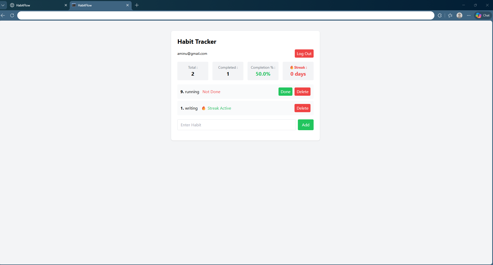

# HabitFlow – Habit Tracker Web App

A full-stack habit tracking app built with Flask, SQLite, and Tailwind CSS.
Users can track habits, view analytics, and monitor streaks.

Features: 
- User authentication (login/register)
- Add, delete, mark habits
- Dashboard with analytics
- Streak tracking

Tech Stack:
- Flask
- SQLite
- Tailwind CSS

## Key Feature: Streak Tracking

This app calculates user streaks using date-based analysis.
It checks for consecutive completion days and stops counting when a gap is found.

This ensures accurate streak tracking rather than simple counting.

## Preview

How to Run
- git clone https://github.com/aminusherif2024/habitflow
- cd habitflow
- pip install -r requirements.txt
- python app.py
